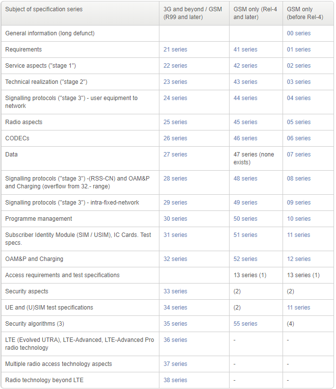

# 3GPP 규격 문서 다운로드 받는 곳

## [Directory Listing /ftp/Specs/archive/ (3gpp.org)](https://www.3gpp.org/ftp/Specs/archive/)

www.3gpp.org  에서 Specifications - file server area 로 링크를 타고 들어가면 3gpp에서 운영하는 ftp 서버에 접속할 수 있다.

## [Specification Numbering (3gpp.org)](https://www.3gpp.org/specifications/79-specification-numbering)

3gpp에서 작성한 모든 규격들을 다운로드 받을 수 있으며, 아래 Numbering page 에서는 규격이 어떤 방식으로 Numbering 되었는지 확인할 수 있다.

