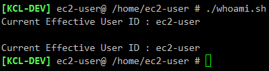

# bash 쉘 스크립트 명령어 실행 결과를 변수에 할당하는 방법

## 방법 1

`$()` 를 이용하여 괄호 내부의 명령어를 변수로 만든다.

## 방법 2
    
**`** (backtick) 으로 명령어를 감싼다

**'** (따옴표) 와 **`** (백틱,backtick) 은 다르다. 보통 키보드 탭(Tab) 버튼 위에 있다.

## 사용 예시

    #!/bin/bash
    # 방법 1
    USER_1=$(whoami)
    echo "Current Effective User ID : "${USER_1}
    echo ""

    # 방법 2
    USER_2=`whoami`
    echo "Current Effective User ID : "${USER_2}
    echo ""

실행 결과, `whoami` 명령어의 결과인 현재 접속한 User ID가 변수에 할당되어 출력되는 것을 확인할 수 있다.

