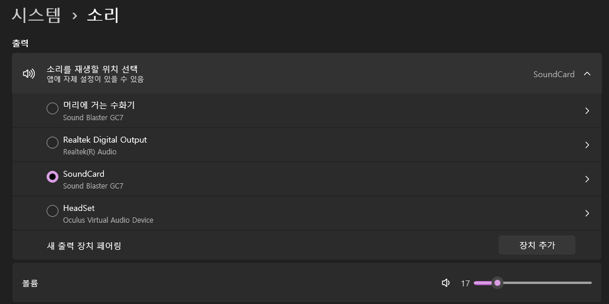
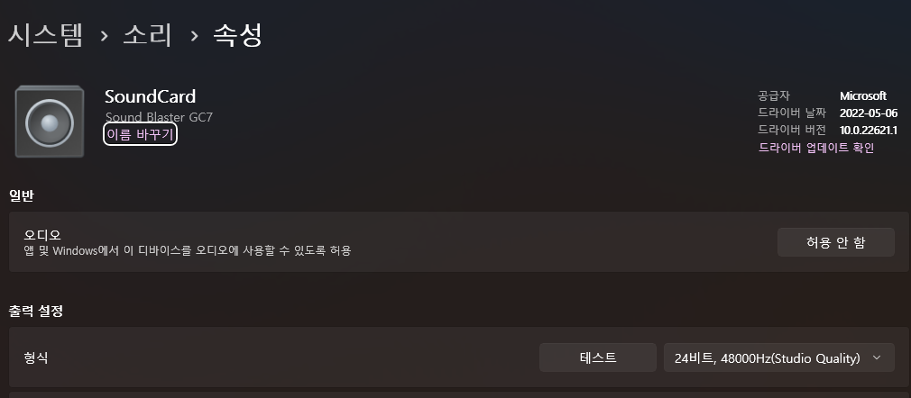

# 윈도우에서 배치 파일로 스피커와 헤드셋 바꾸기

PC방에 가면 배치 파일로 출력 장치를 스피커와 헤드셋을 바꾸게끔 해놓은 곳이 있습니다.

단순한 배치 파일로 보여서 저도 한 번 만들어 보았습니다.

## 1. nircmd 다운로드

nircmd는 윈도우의 여러 기능/설정을 command-line으로 변경할 수 있게 도와주는 프로그램입니다.

[https://www.nirsoft.net/utils/nircmd.html](https://www.nirsoft.net/utils/nircmd.html)에서 가장 아래에 Download 링크가 있습니다.

nircmd에는 다양한 기능이 있지만 그 중 `setdefaultsounddevice` 커맨드를 이용하여 기본 출력 장치를 변경하겠습니다.

## 2. Install 배치 파일 작성

다운로드 받은 nircmd를 특정 경로에 풀고 출력 장치를 전환할 때 사용 할 임시 파일을 생성해주어야 하는데요.

이를 위해 아래와 같은 install.bat 파일을 작성해줍니다.

```batch
:: install.bat
@echo off
chcp 949
:: 관리자 권한 확인 및 요청
>nul 2>&1 "%SYSTEMROOT%\system32\cacls.exe" "%SYSTEMROOT%\system32\config\system"
if '%errorlevel%' NEQ '0' (
    echo 요청한 작업을 완료하려면 관리자 권한이 필요합니다.
    goto UACPrompt
) else ( goto gotAdmin )

:UACPrompt
    echo Set UAC = CreateObject^("Shell.Application"^) > "%temp%\getadmin.vbs"
    echo UAC.ShellExecute "%~s0", "", "", "runas", 1 >> "%temp%\getadmin.vbs"
    "%temp%\getadmin.vbs"
    exit /B

:gotAdmin
    if exist "%temp%\getadmin.vbs" ( del "%temp%\getadmin.vbs" )
    pushd "%CD%"
    CD /D "%~dp0"

:: 폴더 생성 및 압축 해제 코드
set myPath=%~dp0
mkdir "C:\nircmd"
echo "default sound device" > c:\nircmd\speaker.txt
powershell.exe -nologo -noprofile -command "& { Add-Type -A 'System.IO.Compression.FileSystem'; [IO.Compression.ZipFile]::ExtractToDirectory('%myPath%\nircmd-x64.zip', 'C:\nircmd'); }"
```

`C:\nircmd` 경로에 위에서 다운로드 받은 nircmd를 풀어줍니다. `C:\` 경로에 파일을 추가하려면 관리자 권한이 필요하기 때문에 ChatGPT의 도움을 받아 관리자 권한을 요구하는 부분을 추가했습니다.

## 3. 출력 장치 이름 변경하기

윈도우 11 기준입니다.

[설정] - [시스템] - [소리] - [출력] 탭에서, 원하는 출력 장치의 이름을 `Speaker`, `Headset` 으로 변경합니다.

사용 중인 스피커, 헤드셋 장치의 이름을 바꿔주시면 됩니다.

저는 Sound Blaster GC7 장치를 `Speaker`로, Oculus Virtual Audio Device를 `Headset` 으로 변경하겠습니다.

클릭하셔서 이름 바꾸기를 통해 바꾸시면 됩니다.





## 4. 스피커-헤드셋 전환 배치 파일 작성

기본 출력 장치를 스피커와 헤드셋으로 번갈아가며 전환하는 배치 파일을 아래와 같이 작성합니다.

```batch
:: 스피커-헤드셋 전환.bat
@echo off
if exist C:\nircmd\headset.txt (
C:\nircmd\nircmd.exe setdefaultsounddevice "Speaker"
rename C:\nircmd\headset.txt speaker.txt
) else if exist C:\nircmd\speaker.txt (
C:\nircmd\nircmd.exe setdefaultsounddevice "Headset"
rename C:\nircmd\speaker.txt headset.txt
)
```

[https://m.blog.naver.com/ltehoc/221671971189](https://m.blog.naver.com/ltehoc/221671971189)를 참고하여 작성했습니다.

### 4-1. 스피커, 헤드셋 단독 전환 배치 파일 작성

배치 파일을 2개 만들어서 각각 스피커, 헤드셋만으로 전환하길 바라는 경우가 있어서 따로 만들었습니다.

```batch
:: 스피커.bat
@echo off
C:\nircmd\nircmd.exe setdefaultsounddevice "Speaker"
```

```batch
:: 헤드셋.bat
@echo off
C:\nircmd\nircmd.exe setdefaultsounddevice "Headset"
```

## 5. 사용 방법 적기

이제 사용자가 설치 및 사용할 수 있게 사용 방법을 간단하게 작성합니다.

```
1. install.bat 파일 실행합니다.
	-> C:\ 경로에 nircmd-x64.zip 의 압축이 해제됩니다.
2. [설정]-[시스템]-[소리] 에서 출력 장치 이름을 각각 'Speaker', 'Headset'으로 변경합니다.
3. 스피커-헤드셋 전환.bat 파일 실행하면 스피커와 헤드셋 번갈아가며 출력 장치가 전환됩니다.
4. 스피커.bat, 헤드셋.bat 파일들은 각각 스피커, 헤드셋으로 출력 장치가 전환됩니다.

[참고]
배치 파일들을 다른 곳에 저장해놓고, 바로가기를 만들면 확장자(.bat) 없이 이름을 깔끔하게 바꾸고, 아이콘 모양도 원하는 이미지로 변경 가능합니다.
```

## 마무리


간단하게 배치 파일을 만들어 보았습니다.

깔끔하게 설치/실행할 수 있게 만들지 못해서 아쉬운데, 그건 배치파일이 아니라 GUI 프로그램을 만드는게 더 나을 것 같아 이정도로만 하려고 합니다.

감사합니다.