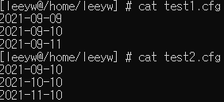

# `find` 명령어 `-exec` 옵션 사용법(특정 파일 문자열 치환)

## find 명령어란?

[find 명령어 사용법](find_명령어_사용법.md) 참고

## `-exec` 옵션?

    -exec utility [argument ...] ;
	     검색된 파일들에 대해서 명령(utility) 실행

[find 명령어 사용법](find_명령어_사용법.md) 문서에서는 위와 같이 간단하게만 적었다.

이 옵션은 find 명령어로 찾은 결과를 원하는 명령어에 적용시켜준다.

## `-exec` 옵션 사용법

    find 조건 -exec 명령어 {} \;

- 실행시킬 명령어의 범위는 `-exec` 부터 `\;` 까지
- `{}` 는 find 명령어로 찾은 결과

## `-exec` 옵션 사용 예시

(다양한 예시는 [리눅스 백과사전 - [리눅스] find 명령어 실습](http://knamhun.blogspot.com/2009/03/find.html) 를 참고.)

특정 파일에서 문자열을 치환하는 방법을 찾아보다가 `find` 명령어와 `perl`을 이용한 방법을 알게 되었다.

`vim` 편집기나 `sed` 명령어를 이용한 방법도 있지만 여기서는 `perl`을 이용한 방법을 설명하겠다.

### `perl` 을 이용한 파일에서 문자열 치환 방법

    perl -pi -e 's/원본 문자열/바꿀 문자열/g' [파일명]

    -p : 지정한 파일을 대상으로 명령어 수행
    -i : 원본 파일을 결과 파일로 대체
    -e : 주어진 Perl 명령 실행

\[파일명\]에 해당하는 파일 안의 '원본 문자열'이 '바꿀 문자열'로 전부(/g) 변경된다. 

이 명령어는 하나의 파일을 대상으로 한다. 

여러 개의 파일을 동시에 하고 싶으면 어떻게 해야 할까?

### `find -exec`와 `perl`을 사용하여 특정 조건의 파일에서 문자열 치환 방법

    find 조건 -exec perl -pi -e 's/원본 문자열/바꿀 문자열/g' {} \;

조건에 해당하는 파일들 안의 '원본 문자열'이 '바꿀 문자열'로 전부(/g) 변경된다.

- 예시

        find ./ -name '*.cfg' -exec perl -pi -e 's/2021-09-10/2021-10-05/g' {} \;

    현재 디렉토리로부터 이름이 `*.cfg` 인 파일 안의 '2021-09-10' 문자열을 '2021-10-05' 문자열로 치환 후 저장

- 수행 결과

`test1.cfg`와 `test2.cfg` 파일을 대상으로 테스트 했다.

'2021-09-10' 문자열이 `test1.cfg` 에는 두 번째 줄에, `test2.cfg` 에는 첫 번째 줄에 있다.

여기서 예시와 같은 명령어를 수행 후 결과는 아래와 같다.

### 참고 자료
- [Intelligent Blog of Byeon - 리눅스 find 명령어 -exec 옵션](https://byeonely.tistory.com/111)
- [방랑자 - find 명령과 exec 옵션의 의미, 그리고 예제들](https://blog.naver.com/aim4u/20134309695)
- [리눅스 백과사전 - [리눅스] find 명령어 실습](http://knamhun.blogspot.com/2009/03/find.html)
- [FreeLife의 저장소 - [리눅스]PERL 을 이용한 문자 치환](https://javafactory.tistory.com/470)