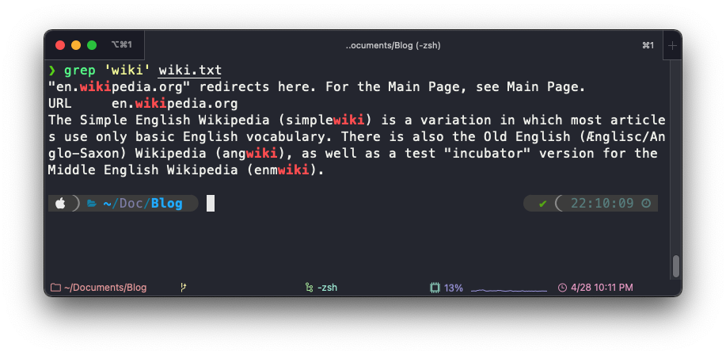
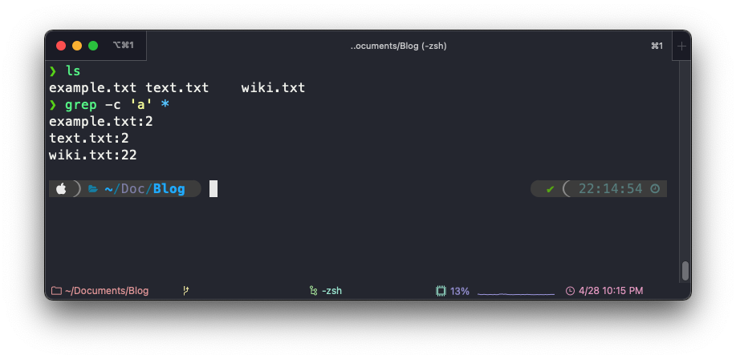
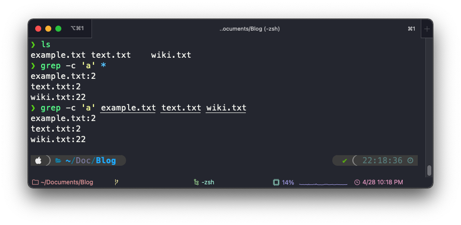

# `grep` 명령어 사용법

## grep 명령어란?
리눅스를 사용하면서 ls , cd 와 같이 가장 많이 사용하는 명령어 중 하나.

텍스트 검색 기능을 가진 명령어로서, 어떤 파일에서 특정 문자열을 찾을 때 사용한다.

## grep 명령어 사용법
    grep [OPTION...] PATTERNS [FILE...]

각각의 FILE 에서 PATTERNS 와 일치하는 내용을 포함하는 Line을 반환한다.

## grep 명령어 옵션
grep 명령어에는 수많은 옵션이 있지만 그중 내가 많이 사용했던 옵션들 위주로 적었다.

    grep [OPTIONS] PATTERN [FILE...]
        -i, --ignore-case                : PATTERN 의 대소문자를 구분하지 않음
        -v, --invert-match                : PATTERN 과 일치하지 않는 라인만 보여줌
        -w, --word-regexp                : PATTERN 과 정확히 일치하는 라인만 출력
        -x, --line-regexp                : 라인 단위로 PATTERN 과 정확히 일치하는 경우
        -c, --count                        : 파일 당 PATTERN 과 일치하는 라인의 수를 출력
        -L, --files-without-match        : PATTERN 이 존재하지 않는 파일의 이름을 표시
        -l, --files-with-matches           : PATTERN 이 존재하는 파일의 이름을 표시
        -o, --only-matching                : PATTERN 과 일치하는 문자열만 출력
        -n, --line-number                : PATTERN 과 일치하는 라인의 번호를 함께 출력

다른 옵션은 grep의 man page를 참고.

## grep 명령어 사용 예시

wiki.txt 라는 파일에 'wiki' 라는 문자열을 검색한 결과

grep 을 사용하면서 찾고자 하는 문자열을 ' 또는 " , 따옴표로 묶어주면 정확하게 찾을 수 있다.

grep 사용 예시
example.txt
text.txt
wiki.txt
이 3가지 파일에 'a' 라는 문자열이 몇 개나 있는지 알고 싶다면 사진과 같이 * asterisk 로 한 번에 여러 파일을 검색할 수 있다.

물론 아래와 같이 파일을 개별로 여러 개를 지정하는 것도 가능하다.

