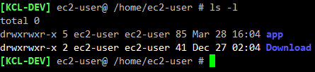

# ls 명령어 사용법

## ls 명령어란?

File들(기본적으로 현재 디렉토리)에 대한 정보를 나열한다. 따로 옵션이 없는 경우 알파벳 순으로 정렬한다.

## ls 명령어 사용법
    ls [OPTION]... [FILE]...

FILE 에 대한 정보를 OPTION 에 따라 나열한다.

## ls 명령어 옵션
ls 명령어에도 수많은 옵션이 있다. 그 중 중요하다고 생각하는 몇 가지만 추려봤다.

    ls [OPTION]... [FILE]...
        -a, --all               : do not ignore entries starting with .
        -l                      : use a long listing format
        -h, --human-readable    : with -l, print sizes in human readable format (e.g., 1K 234M 2G)
        -r, --reverse           : reverse order while sorting
        -R, --recursive         : list subdirectories recursively
        -S                      : sort by file size
        -t                      : sort by modification time, newest first

다른 옵션은 ls의 man page를 참고.

## ls 명령어 사용 예시

