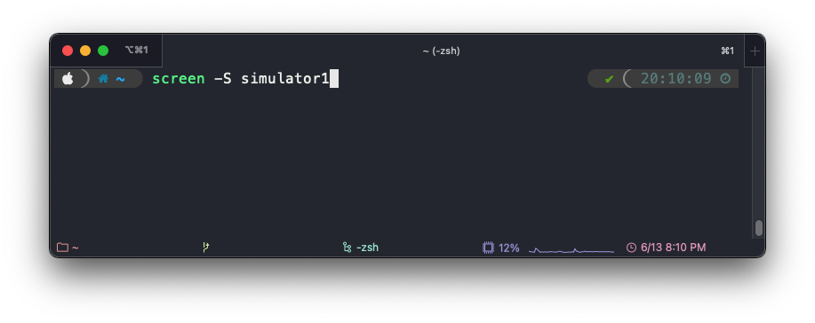
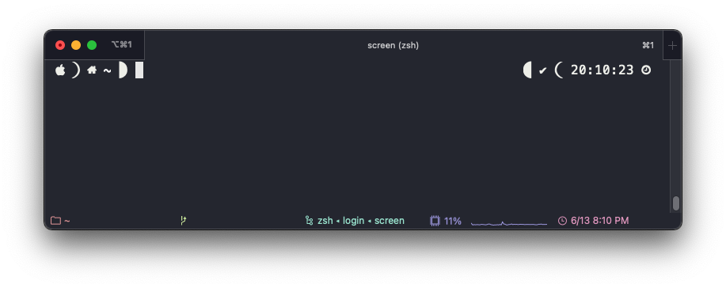

# `screen` 명령어 사용법

## `screen` 명령어란?

해당 서비스 또는 프로그램을 백그라운드로 실행시키고자 할 때 사용한다.

실제 기능은 *virtual terminal emulation*, 즉, 터미널을 가상화해서 다중 사용할 수 있게 만들어주는 명령어.

`nohup`이나 `&` 를 이용한 백그라운드 실행으로는 로그나 현재 상태 등을 확인할 수 없기 때문에 이를 해결할 수 있는 명령어이다.

터미널을 가상화해서 띄워놓기 때문에, 서버가 죽지 않는 한 어디서든, 누구든 작업을 이어서 할 수 있는 장점이 있다.

## `screen` 명령어 설치 방법

기본적으로 설치 되어있는 경우도 있지만, 설치되어 있지 않다면 배포판에 따라 아래와 같은 명령어로 설치하면 된다.

    RedHat 계열
    yum install screen

    Debian 계열
    apt install screen

## `screen` 명령어 사용법

    screen [ -options ] [ cmd [ args ] ]

## `screen` 명령어 옵션
screen 명령어

    screen [OPTIONS] PATTERN [FILE...]
        -i, --ignore-case                : PATTERN 의 대소문자를 구분하지 않음
        -v, --invert-match                : PATTERN 과 일치하지 않는 라인만 보여줌
        -w, --word-regexp                : PATTERN 과 정확히 일치하는 라인만 출력
        -x, --line-regexp                : 라인 단위로 PATTERN 과 정확히 일치하는 경우
        -c, --count                        : 파일 당 PATTERN 과 일치하는 라인의 수를 출력
        -L, --files-without-match        : PATTERN 이 존재하지 않는 파일의 이름을 표시
        -l, --files-with-matches           : PATTERN 이 존재하는 파일의 이름을 표시
        -o, --only-matching                : PATTERN 과 일치하는 문자열만 출력
        -n, --line-number                : PATTERN 과 일치하는 라인의 번호를 함께 출력

다른 옵션은 screen의 man page를 참고.

## `screen` 명령어 사용 예시

wiki.txt 라는 파일에 'wiki' 라는 문자열을 검색한 결과

screen 을 사용하면서 찾고자 하는 문자열을 ' 또는 " , 따옴표로 묶어주면 정확하게 찾을 수 있다.

screen 사용 예시
example.txt
text.txt
wiki.txt
이 3가지 파일에 'a' 라는 문자열이 몇 개나 있는지 알고 싶다면 사진과 같이 * asterisk 로 한 번에 여러 파일을 검색할 수 있다.

물론 아래와 같이 파일을 개별로 여러 개를 지정하는 것도 가능하다.

## 참고 자료

- [IT는 검색이 힘이다 - 리눅스 Screen 명령어 모음](https://helloitstory.tistory.com/132)
- [人CoDOM - Linux > 기본명령어 > screen](http://www.incodom.kr/Linux/%EA%B8%B0%EB%B3%B8%EB%AA%85%EB%A0%B9%EC%96%B4/screen)
- [Sysops Notepad - [Linux] screen 사용 방법](https://sysops.tistory.com/44)
- [die.net screen(1) - Linux man page](https://linux.die.net/man/1/screen)