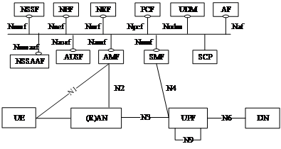

# 3GPP 5G System Architecture

3GPP 5G 시스템 아키텍처에 대해 간단히 정리합니다.

## GPT-4에게 물어보기

    Title: Understanding 3GPP 5G System Architecture
    제목 : 3GPP 5G 시스템 아키텍처에 대한 이해

    Introduction:
    The 5G system architecture, as defined by the 3rd Generation Partnership Project (3GPP), is the foundation of the next-generation mobile networks. Designed to offer enhanced performance, flexibility, and scalability, the 5G architecture supports various use cases, including enhanced mobile broadband (eMBB), ultra-reliable low-latency communication (URLLC), and massive machine-type communications (mMTC). In this article, we'll explore the key components of the 3GPP 5G system architecture and explain how they work together to deliver a seamless, high-performance mobile experience.

    5G 시스템 아키텍처는 3GPP에 의해 정의된 차세대 모바일 네트워크 기반입니다. 향상된 성능, 유연성과 확장성을 제공하도록 설계된 5G 아키텍처는 eMBB, URLLC, mMTC 등 다양한 use case를 제공합니다. 이 글에서는, 3GPP 5G 시스템 아키텍처의 주요 구성 요소를 살펴보고, 이러한 구성 요소들이 어떻게 함께 작동하여 seamless하고 high-performance의 모바일 경험을 제공하는지 설명합니다.

    5G Core Network (5GC):
    The 5G Core Network (5GC) is a fundamental component of the 5G system architecture. It comprises a series of cloud-native, modular, and service-based functions that enable efficient network management, resource allocation, and user data handling. Key 5GC functions include:

    5G 코어 네트워크 (5GC):
    5G 코어 네트워크(5GC)는 5G 시스템 아키텍처의 기본(fundamental) 구성 요소입니다. 효율적인 네트워크 관리, 자원 할당과 가입자 데이터 처리를 가능하게 하는 클라우드 네이티브(CNV), 모듈러, 서비스 기반 기능(SBA)로 이루어집니다.

    a. Authentication and Security: The Authentication Server Function (AUSF) and Security Edge Protection Proxy (SEPP) ensure secure and authenticated access to the network.
    a. 인증 및 보안: Authentication Server Function(AUSF)와 Security Edge Protection Proxy(SEPP)는 네트워크에 대한 안전하고 인증된 access를 보장합니다.

    b. Session Management: The Session Management Function (SMF) manages user sessions, including data flow establishment and resource allocation.
    b. 세션 관리: Session Management Function(SMF)는 데이터 플로우 설정(establishment) 및 리소스 할당 등 가입자 세션을 관리합니다.

    c. User Data Handling: The Unified Data Management (UDM) and User Plane Function (UPF) handle user data and enforce policies to optimize network performance.
    c. 가입자 데이터 처리: Unified Data Management(UDM) 과 User Plane Function(UPF)는 가입자 데이터를 처리하고 네트워크 성능을 최적화하는 policy들을 관리합니다.

    Next Generation Radio Access Network (NG-RAN):
    The Next Generation Radio Access Network (NG-RAN) comprises the 5G New Radio (NR) base stations and provides the wireless connectivity between devices and the core network. The NG-RAN includes the following components:

    차세대 무선 액세스 네트워크(NG-RAN):
    5G NR(New Radio) 기지국으로 구성된 차세대 무선 액세스 네트워크(NG-RAN)은 단말과 코어 네트워크간 무선 연결을 제공합니다. NG-RAN은 다음과 같은 구성 요소가 포함됩니다.

    a. gNodeB (gNB): The gNodeB is the 5G equivalent of the 4G eNodeB, responsible for radio resource management, user equipment (UE) mobility, and the transmission of user data.
    a. gNodeB (gNB): 4G의 eNodeB와 동일한 역할을 수행하며 무선 리소스 관리, UE 이동성 및 가입자 데이터 전송을 담당합니다.

    b. Xn Interface: The Xn interface enables communication between gNodeBs, allowing for efficient handover, load balancing, and interference management.
    b. Xn 인터페이스: Xn 인터페이스는 gNodeB들간 통신에서 효율적인 핸드오버, 로드밸런싱 및 간섭 관리가 가능하도록 합니다.

    c. NG Interface: The NG interface connects the NG-RAN to the 5GC, enabling data and control plane communication.
    c. NG 인터페이스: NG 인터페이스는 NG-RAN을 5GC에 연결하여 데이터 및 컨트롤 플레인(CP) 통신을 가능하게 합니다.

    Network Slicing:
    One of the most innovative features of the 5G system architecture is network slicing. It allows operators to create multiple virtual networks on top of a single physical network infrastructure. Each network slice can be tailored to support specific use cases, providing dedicated resources, QoS levels, and security settings. Network slicing enables the efficient allocation of network resources and enhances the overall performance and flexibility of the 5G system.

    네트워크 슬라이싱:
    5G 시스템 아키텍처의 가장 혁신적인 기능 중 하나는 네트워크 슬라이싱입니다. 네트워크 슬라이싱을 통해 단일 물리적 네트워크 인프라에 여러 개의 가상 네트워크를 올릴 수 있습니다. 각각의 네트워크 슬라이스는 특정 use cases를 지원하도록 맞춤화할 수 있으며 전용 리소스, QoS, 보안 설정을 제공할 수 있습니다. 네트워크 슬라이싱은 네트워크 리소스의 효율적으로 할당하고 5G 시스템의 전반적인 성능과 유연성을 향상시킬 수 있습니다.

    Multi-Access Edge Computing (MEC):
    Multi-Access Edge Computing (MEC) is another important aspect of the 5G system architecture. MEC brings cloud computing capabilities closer to the network edge, reducing latency and improving user experience. By processing data and running applications closer to the source, MEC allows for faster response times, improved privacy, and more efficient use of network resources.

    Multi-Access Edge Computing (MEC):
    Multi-Access Edge Computing (MEC)는 5G 시스템 아키텍처의 또 다른 중요한 부분입니다. MEC는 클라우드 컴퓨팅 기능(capabilities)를 네트워크 edge에 더 가깝게 가져와서 레이턴시를 줄이고 사용자 경험을 향상시킵니다. 데이터를 처리하는 애플리케이션을 소스에 더 가깝게 실행함으로써 MEC는 응답 시간을 단축하고 개인정보보호를 개선하며 네트워크 리소스를 더 효율적으로 사용할 수 있게 해줍니다.

    Conclusion:
    The 3GPP 5G system architecture has been designed to cater to the diverse requirements of next-generation mobile networks. By incorporating advanced features like network slicing, edge computing, and a flexible, modular core network, 5G is set to transform the way we communicate, work, and live. As operators continue to deploy and expand their 5G networks, we can expect to see significant improvements in speed, latency, and overall network performance, enabling a wide range of new applications and use cases.

    결론:
    3GPP 5G 시스템 아키텍처는 차세대 모바일 네트워크의 다양한 요구사항을 충족하도록 설계되었습니다. 네트워크 슬라이싱, 엣지 컴퓨팅, 유연한 모듈형 코어 네트워크와 같은 기능을 통합함으로써 5G는 우리의 통신, 업무, 생활 방식을 변화시킬 것입니다. 통신 사업자가 5G 네트워크를 지속적으로 배포하고 확장함에 따라 속도, 지연 시간 및 전반적인 네트워크 성능이 크게 개선되어 다양한 새로운 애플리케이션과 use cases가 등장할 것으로 예상됩니다.

얼추 다 맞는 말인데 뭔가 생략되거나 맞지 않는 부분도 있는 것 같다.

전혀 모르는 걸 GPT-4한테 물어보면 나중에 곤란한 일이 생길지도 모르겠다.

## Network Funtions (NFs) and entities

5G 시스템 아키텍쳐의 network funtion들과 entity들을 요약하면 아래와 같습니다.

| Entities                                      | Description |
| --------------------------------------------- | ----------- |
| UE (User Equipment)                           | 이동통신망에서 end-user가 직접 통신하는 모든 device들, 즉, 단말을 의미 ([참고](https://github.com/lyw1217/TIL/blob/main/Moblie/User_Equipment.md))            |
| RAN (Radio Access Network)                    | 이동통신망의 무선 단말과 접속을 이루는 무선영역을 담당하는 망([참고](http://www.ktword.co.kr/test/view/view.php?m_temp1=4252)), 즉, 기지국을 의미          |
| AMF (Access and Mobility Management Function) | 단말의 이동성 관리 역할            |
| SMF (Session Management Function)             | 단말의 데이터 전송을 위한 세션 관리 역할           |
| UPF (User Plane Function)                     | Data Network와 연결되어 데이터 패킷의 전송을 담당            |
| PCF (Policy Control Function)                 | 사업자 과금이나 제어 정책에 대한 정보 관리            |
| NRF (Network Repository Function)             | NF의 서비스 상태 모니터링 및 연동 정보 관리            |
| UDM (Unified Data Management)                 | 단말의 가입자 정보 관리            |
| UDR (Unified Data Repository)                 | 가입자 관련 데이터 저장 및 조회 기능            |
| AUSF (Authentication Server Function)         | 단말의 인증 담당            |
| NSSF (Network Slice Selection Function)       | 네트워크 슬라이스 관련 정보 저장 관리            |

접기/펼치기

- The 5G System architecture consists of the following network functions (NF):
    -	Authentication Server Function (AUSF).
    -	Access and Mobility Management Function (AMF).
    -	Data Network (DN), e.g. operator services, Internet access or 3rd party services.
    -	Unstructured Data Storage Function (UDSF).
    -	Network Exposure Function (NEF).
    -	Network Repository Function (NRF).
    -	Network Slice Specific Authentication and Authorization Function (NSSAAF).
    -	Network Slice Selection Function (NSSF).
    -	Policy Control Function (PCF).
    -	Session Management Function (SMF).
    -	Unified Data Management (UDM).
    -	Unified Data Repository (UDR).
    -	User Plane Function (UPF).
    -	UE radio Capability Management Function (UCMF).
    -	Application Function (AF).
    -	User Equipment (UE).
    -	(Radio) Access Network ((R)AN).
    -	5G-Equipment Identity Register (5G-EIR).
    -	Network Data Analytics Function (NWDAF).
    -	CHarging Function (CHF).

- The 5G System architecture also comprises the following network entities:
    -	Service Communication Proxy (SCP).
    -	Security Edge Protection Proxy (SEPP).
    -	Non-3GPP InterWorking Function (N3IWF).
    -	Trusted Non-3GPP Gateway Function (TNGF).
    -	Wireline Access Gateway Function (W-AGF).
    -	Trusted WLAN Interworking Function (TWIF).

 

## Non-roaming reference architecture

Figure 4.2.3-1: 5G System architecture

## 참고 자료
- [3GPP TS 23.501 V16.6.0](https://portal.3gpp.org/desktopmodules/Specifications/SpecificationDetails.aspx?specificationId=3144)
- [Seog-Gyu Kim - [Efficient Congestion Control for Interworking between 5G-System and LTE]](https://www.google.com/url?sa=t&rct=j&q=&esrc=s&source=web&cd=&ved=2ahUKEwjqz86dyInyAhWIOpQKHU-VDesQFjACegQIBxAD&url=http%3A%2F%2Fkoreascience.or.kr%2Farticle%2FJAKO201910537995269.pdf&usg=AOvVaw28pgjNGzzMydWj8uflVBiy)
- [5G Standalone Access Registration - UE registers with the 5G Core Network (5GC) via the 5G-RAN](https://medium.com/5g-nr/5g-standalone-access-registration-fe80aa28d723)
- [5G standalone access registration signaling flow](https://www.eventhelix.com/5G/standalone-access-registration/5g-standalone-access-registration.pdf)
- [5G-NR Standalone Access Registration](https://www.eventhelix.com/5G/standalone-access-registration/)
- [5G-NR Non-standalone access call flows](https://www.eventhelix.com/5G/non-standalone-access-en-dc/)
- [Samsung - 5G 국제 표준의 이해](https://www.google.com/url?sa=t&rct=j&q=&esrc=s&source=web&cd=&ved=2ahUKEwi51aLL3onyAhUJQd4KHWRTAVkQFjAAegQIBxAD&url=https%3A%2F%2Fimages.samsung.com%2Fis%2Fcontent%2Fsamsung%2Fp5%2Fglobal%2Fbusiness%2Fnetworks%2Finsights%2Fwhite-paper%2Fwho-and-how_making-5g-nr-standards%2Fwho-and-how_making-5g-nr-standards_KR.pdf&usg=AOvVaw2t0Vf77taAfqBn61s_dJHg)
- [한국정보통신기술협회 - 5G 네트워크/시스템 구조 기술](https://www.google.com/url?sa=t&rct=j&q=&esrc=s&source=web&cd=&ved=2ahUKEwi51aLL3onyAhUJQd4KHWRTAVkQFjADegQIAxAD&url=https%3A%2F%2Fwww.tta.or.kr%2Fdata%2FandroReport%2FttaJnal%2F175-2-3-4.pdf&usg=AOvVaw08kotd-Gs93YrK12P6UiQ9)
- [netmanias, 코어 네트워크 진화 - 5G 서비스 기반 구조](https://www.netmanias.com/ko/post/blog/13206/5g/core-network-evolution-5g-service-based-arhcitecture)
- [Sense Wide - [5G] 5G 네트워크 구조 정리 (5G RAN과 5G Core)](https://jb-story.tistory.com/346)